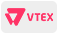

  &nbsp;

    

  

  &nbsp;

    

  &nbsp;

  <!-- Badge - Visitas -->
  
  &nbsp;
  <!-- Badge - LinkedIn -->
  
  &nbsp;
  <!-- Badge - Gmail -->
  
   &nbsp;
  <!-- Badge - Twitter -->
  
   &nbsp;
    <!-- Badge - My Settings -->
  

<!-- Apresentação -->
###  Olá, Meu Nome é Gohara Junior

---

### 🎯 Objetivo para subir para o próximo nível 🎯

  📌 Focar em aprender implementações de lojas virtuais e todas as tecnologias que envolve esse eco sistema.

---
## 💻 <strong>Plataformas E-Commerce</strong>
**Estou estudando ↴**

  <!-- TRAY Icon -->
  <a href="https://www.traycorp.com.br/" target="_blank">
    &nbsp;
  </a>

**Tenho interesse ↴**

  <!-- TRAY Icon -->
  <a href="https://www.traycorp.com.br/" target="_blank">
    &nbsp;
  </a>

---

## 👨🏼‍💻 <strong>Tecnologias</strong>
**Estou estudando ↴**

  <!-- JS Icon -->
    &nbsp;
  <!-- Twig Icon -->
  <a href="https://twig.symfony.com/" target="_blank">
    &nbsp;
  </a>
  <!-- jQuery Icon -->
  <a href="#" target="_blank">
    &nbsp;
  </a>

**Tenho experiência ↴**

  <!-- CSS Icon -->
  &nbsp;
  <!-- HTML Icon -->
  &nbsp;
  <!-- Git Icon -->
  &nbsp;
  <!-- Figma Icon -->
  &nbsp;
  <!-- Adobe XD -->
  &nbsp;

**Tenho interesse ↴**

  <!-- React Icon -->
  &nbsp;
  <!-- TS Icon -->
  &nbsp;
  <!-- NextJS Icon -->
  &nbsp;
  <!-- RN Icon -->
  &nbsp;
  <!-- NodeJS Icon -->
  &nbsp;

---

<table align='left'>
  <row>
    <td>
     <!-- Card -->
      
    </td>
    <td>
      
    </td>
  </row>
</table>

<!-- Commit's animation -->

  

