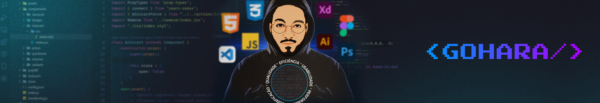

  

  <!-- Badge - LinkedIn -->
  
  &nbsp;
  <!-- Badge - Twitter -->
  
   &nbsp;

---

###  Hello, I'm Gohara!

### 👨🏼‍💻 <strong>Skills</strong>

  &nbsp;
  &nbsp;
  &nbsp;
  &nbsp;
  &nbsp;
  &nbsp;
  &nbsp;
  &nbsp;

### 🛠 <strong>Tools</strong>
&nbsp;
&nbsp;
&nbsp;

